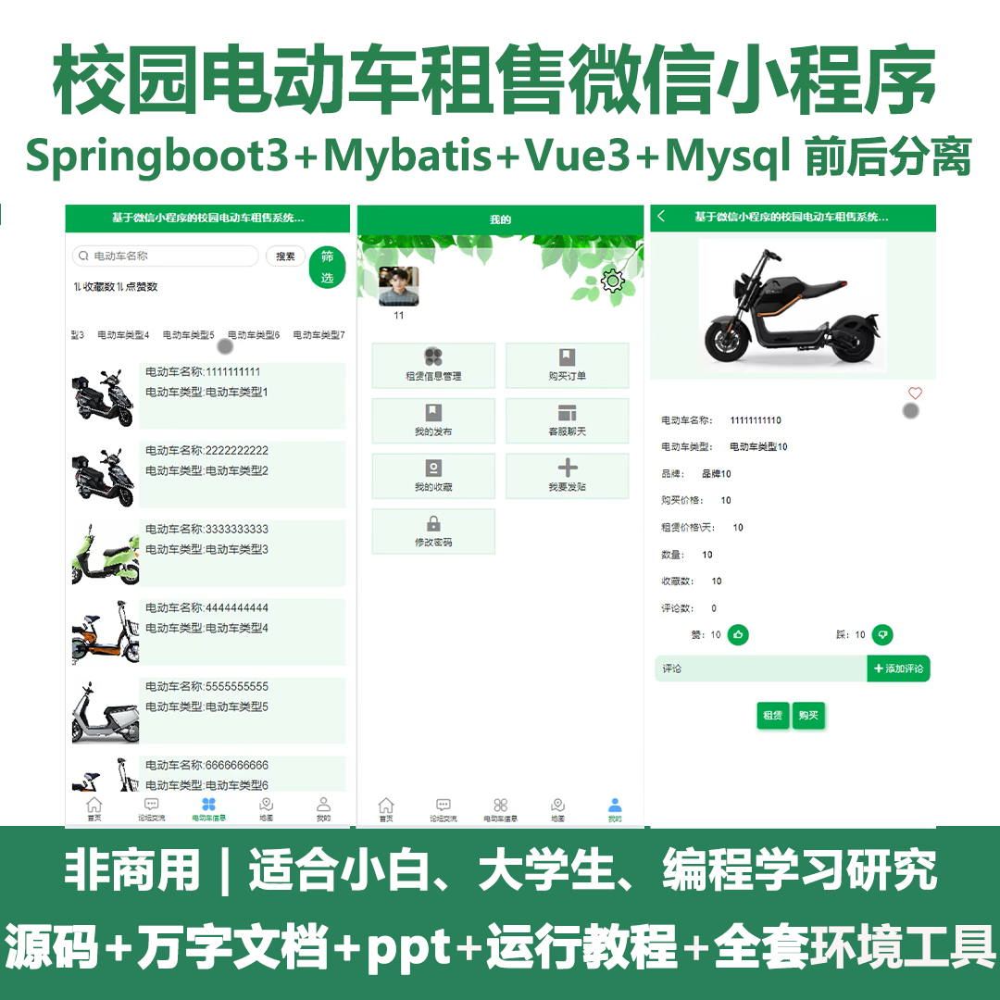
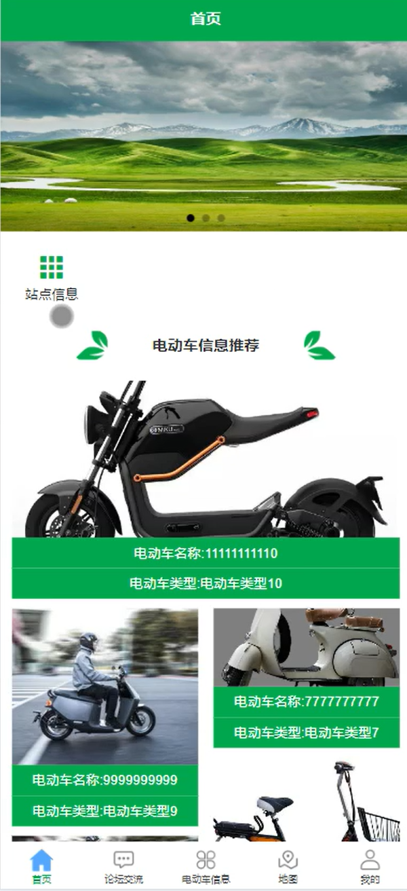
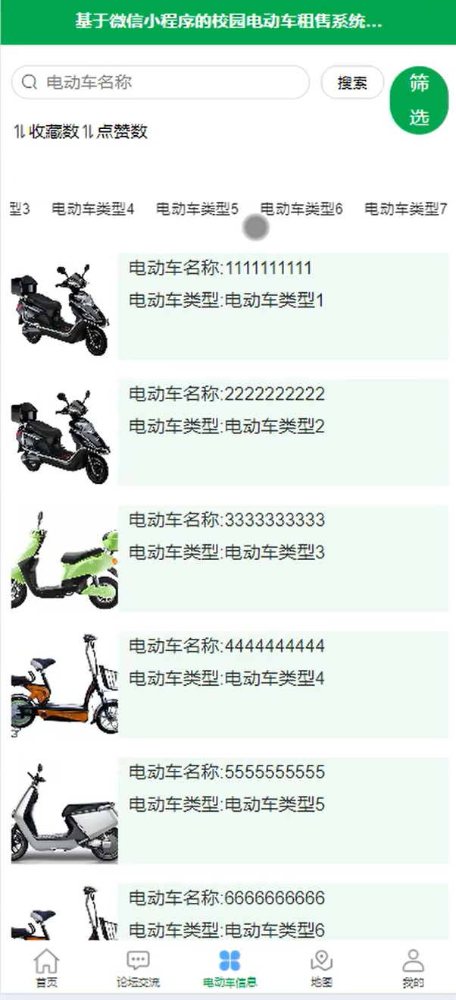
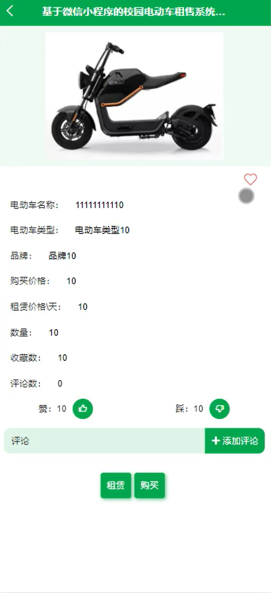
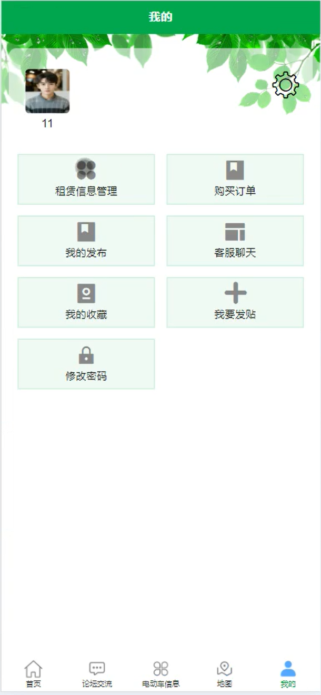
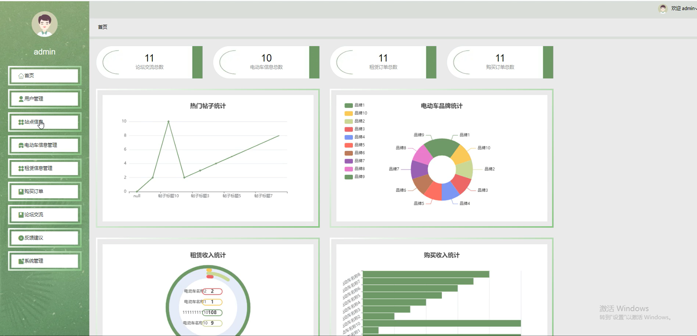
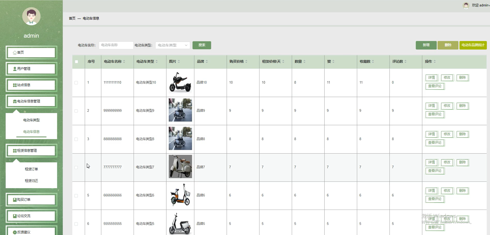
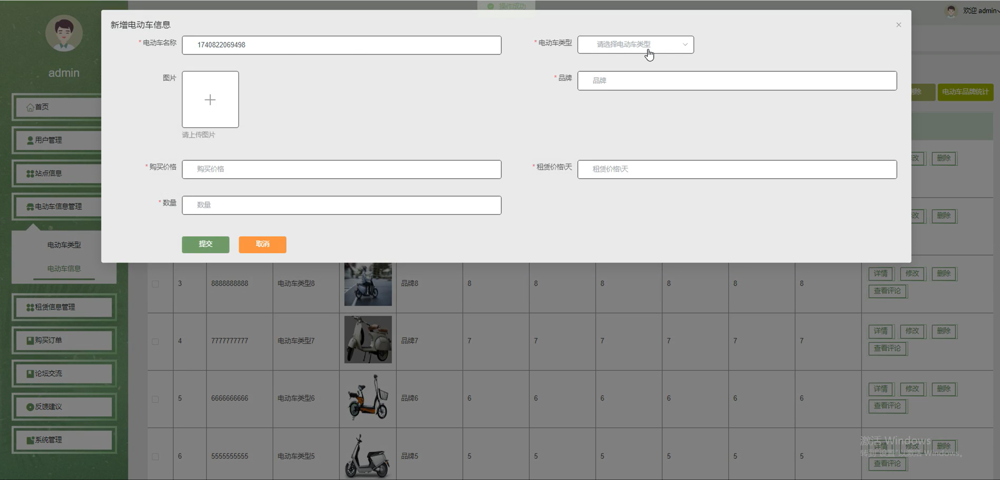
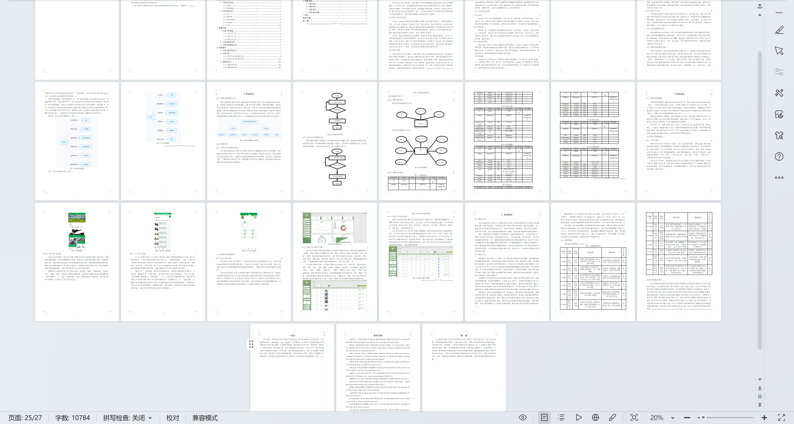

# mpweixinA213D
mpweixinA213D校园电动车租售微信小程序+LW+PPT
 
## 源码问题查看主页咨询

### 一、关键词
租赁信息管理，站点信息，电动车信息管理

### 二、作品包含
源码+数据库+万字设计文档+PPT+全套环境和工具资源+本地部署教程

### 三、项目技术
前端技术： Html、Css、Js、Vue3.0、Element-plus、uniapp
后端技术：Java、SpringBoot3.0、MyBatis

### 四、运行环境（以下版本亲测，其他版本兼容性请自行测试）
开发工具：IDEA/eclipse  + VSCODE + 微信开发者工具 + HBuilder X

数据库：MySQL5.7（最低要5.7版本）

数据库管理工具：Navicat10以上版本

环境配置软件： JDK17 + Maven3.6.3

前端Nodejs：20

浏览器：谷歌浏览器

### 五、项目介绍
项目编号：mpweixinA213D

校园电动车租售微信小程序，是为校园师生提供电动车租赁管理，同时支持管理员管控用户、车辆信息与平台运营的便捷工具。

角色：管理员、用户

用户功能：首页、论坛交流、电动车信息、地图、我的、租赁信息管理、购买订单、客服聊天、我要发贴、我的发布、我的收藏、修改密码。

管理员功能：首页、用户管理、站点信息、电动车信息管理、租赁信息管理、购买订单、论坛交流、反馈建议、系统管理。

### 六、运行截图

